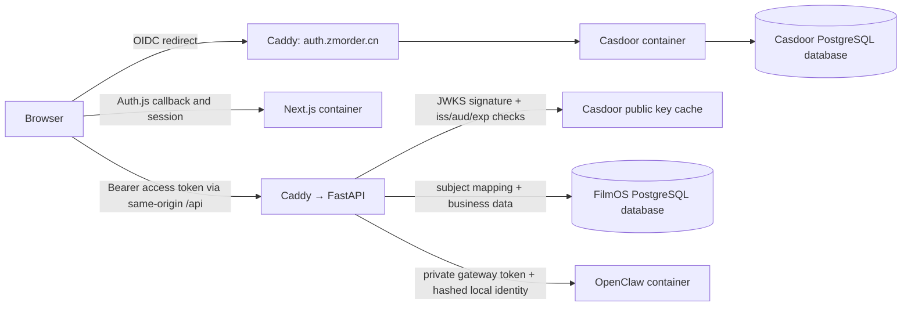

# Casdoor authentication and RBAC design

## 1. System boundary

Casdoor authenticates users and emits one FilmOS role. FastAPI verifies that
evidence, maps the external subject to a stable local user, and performs all
authorization checks. Next.js owns login/session UX. It does not decide whether
a business request is allowed.

OpenClaw remains unchanged at the trust boundary: only FastAPI can call it, and
its stable session key continues to derive from the local FilmOS user ID. An
OIDC subject or token is never sent to OpenClaw.

## 2. OIDC and session contracts

### Casdoor application

- Authorization-code flow with OIDC discovery-compatible endpoints.
- RS256 signing and JWKS publication.
- `JWT-Custom` access tokens containing only registered claims plus the minimum
  application claims: normalized email, organization, `isForbidden`, and role
  names. This avoids Casdoor's broad default user-token payload.
- `aud` is the FilmOS Casdoor client ID and `iss` is the externally visible
  Casdoor origin.
- Access-token lifetime: 15 minutes. Refresh-token lifetime: 24 hours. Auth.js
  application session lifetime: 8 hours.
- Self-signup and dynamic client registration disabled.
- Exact redirect URLs for the active private or public environment; wildcard
  callbacks are forbidden.

The implementation will keep separate public and internal Casdoor URLs. Browser
authorization redirects use the public URL, while Next.js token/userinfo calls
and FastAPI JWKS retrieval use the private container URL. Token validation still
requires the external issuer value, preventing an internal URL from becoming a
second accepted issuer.

### Auth.js token lifecycle

The encrypted, HttpOnly Auth.js cookie stores the Casdoor access token, refresh
token, access-token expiry, local FilmOS user ID, and mapped role. The browser
session response exposes only the short-lived access token, local ID, email, and
role; it never exposes the refresh token or client secret.

On initial sign-in and after each successful refresh, Next.js calls a protected
FastAPI identity endpoint with the Casdoor access token. FastAPI returns the
stable local user projection. A failed refresh marks the session invalid and the
next browser operation signs out instead of retrying indefinitely.

This preserves the current direct SSE path without introducing Redis or a new
server-side session store. The accepted tradeoff is that browser JavaScript can
read the 15-minute access token, as it can read the current FilmOS bearer token;
the long-lived refresh credential remains HttpOnly.

Logout clears the Auth.js cookie and calls Casdoor's discovered end-session or
documented logout endpoint. Manual verification must prove a shared browser does
not silently restore the previous user's FilmOS session.

## 3. FastAPI authentication

`get_current_user` becomes an async database-backed dependency:

1. Require a bearer token.
2. Resolve the signing key through the configured private JWKS URL with bounded
   caching and timeout.
3. Accept only the configured asymmetric algorithm and validate signature,
   `iss`, `aud`, `exp`, `nbf`, `sub`, and access-token type.
4. Require the FilmOS Casdoor organization and reject forbidden/deleted users.
5. Normalize role objects/names at one decoder boundary and require exactly one
   of `filmos-owner` or `filmos-operator`.
6. Resolve or provision the local user in one database transaction.
7. Return `CurrentUser` with local ID, email, and the local enum role used by
   business dependencies.

JWKS/network failures return a stable `503` only when no cached key can validate
the request. Invalid identity evidence returns `401`; valid identity without the
required business role returns `403`. Raw provider errors and token contents are
never logged or returned.

### Local identity projection

The `users` table gains:

- nullable, unique, indexed `external_subject`;
- nullable `password_hash` for migrated and rollback-era users;
- updated email and role projection timestamps only if needed by the final
  implementation after inspecting existing timestamp conventions.

Resolution rules are deterministic:

- Existing `external_subject` match wins.
- Otherwise, one unlinked local row with the exact normalized token email may be
  linked atomically. This is allowed because production signup is closed and the
  Casdoor organization is administrator-controlled.
- Otherwise, a new local user is created with the external subject and mapped
  role.
- A subject/email uniqueness race is retried by re-reading the winning row; an
  actual subject/email conflict is denied and logged by identifiers only.
- Email and role are synchronized from verified claims. The local ID never
  changes.

The legacy password endpoint may remain available only in explicit local
development mode during the transition. Production validation requires Casdoor
mode, and Casdoor mode rejects locally signed HS256 tokens.

## 4. Authorization model

A shared backend dependency such as `require_roles(...)` owns role checks. It is
applied to master-data write routes, while ordinary authenticated dependencies
cover reads, order/production operations, and Agent operations. Existing Agent
service-level ownership checks remain mandatory and are tested independently of
role checks.

The frontend session type uses the same `OWNER` / `OPERATOR` string enum. It hides
the owner-only settings navigation and protects direct `/settings` navigation,
but every write still receives a backend check.

Casdoor role assignments are the coarse-role source. A role change or account
ban may leave an already-issued token usable for at most 15 minutes. Per-request
introspection and webhook-driven revocation are deliberately deferred to avoid
making every FilmOS request depend on Casdoor availability.

## 5. Casdoor bootstrap and persistence

### Database

The existing PostgreSQL container hosts two databases:

- `${POSTGRES_DB}` owned by the FilmOS application role;
- `${CASDOOR_DB}` owned by a separate `${CASDOOR_DB_USER}` role.

An idempotent deployment step runs through the PostgreSQL administrative role to
create or reconcile the Casdoor login/database before Casdoor starts. Docker
entrypoint initialization files are not sufficient because the user's production
volume may already exist.

FilmOS does not query Casdoor tables. Casdoor does not query FilmOS tables.

### Runtime initialization

Committed files contain only templates and non-secret defaults. The deployment
script writes a mode-0600 runtime Casdoor config/init payload under ignored
`.data/` from `.env.production`, including:

- FilmOS organization and application;
- exact redirect URI, client ID/secret, and signing certificate selection;
- closed signup and disabled DCR;
- `filmos-owner` and `filmos-operator` roles;
- the initial organization administrator/owner account.

Casdoor's built-in bootstrap administrator is rotated before Caddy starts. The
bootstrap is idempotent, preserves later role/user administration, and aborts the
deployment if the default credential still works or any placeholder remains.

### Container exposure

- `casdoor` joins the application and database networks, has no host port, and
  cannot join the Agent network.
- Caddy owns both `app.zmorder.cn` and `auth.zmorder.cn` in public mode.
- Private mode uses documented local hostnames over the existing SSH tunnel so
  the two OIDC origins remain distinct without public DNS.
- The image is pinned to `casbin/casdoor:3.125.0` and the verified digest rather
  than `latest`.
- JSON container logs are rotated; Casdoor file logging is disabled or bounded.

## 6. Backup and restore

Casdoor configuration is operationally required, so backup success means both
database dumps validate. The scripts produce a matched backup set (or manifest)
for FilmOS and Casdoor with restrictive permissions and retention cleanup only
after all new dumps validate.

Restore remains explicit and destructive:

- FilmOS restore stops Caddy, frontend, backend, and other FilmOS writers.
- Casdoor restore also stops Caddy and Casdoor.
- Each database is replaced independently using the correct owner.
- Application migrations/health checks run before traffic resumes.
- A failed restore leaves writers stopped for investigation.

OpenClaw's named-volume state is still outside the PostgreSQL backup and remains
non-authoritative Agent context.

## 7. Rollout and rollback

1. Apply the nullable user-link migration while legacy login still exists.
2. Deploy Casdoor privately, initialize it, and verify discovery/JWKS/health.
3. Create or seed the first Casdoor owner with the exact existing FilmOS email.
4. Enable Casdoor auth, log in, and verify that the same local user ID and chat
   sessions are used.
5. Test both roles, token refresh, federated logout, and OpenClaw chat.
6. Only after ICP approval, configure both public DNS names and enable Caddy TLS.

Rollback before public use switches back to the previous application commit and
legacy auth configuration while leaving the nullable identity columns and
Casdoor database intact. Database restore is not automatic. After Casdoor has
become the only credential system and new users exist, rollback requires an
explicit account-access plan and cannot assume those users have local passwords.

## 8. Security and compatibility notes

- No token, password, client secret, signing private key, cookie, or complete
  provider response enters logs or Git.
- Algorithm, issuer, and audience are configuration constants, never selected
  from untrusted token input.
- Role parsing is centralized and fail-closed; unknown role names do not become
  operators by default.
- Existing business/API JSON remains `snake_case`; Casdoor's external claim
  casing is normalized only at the OIDC boundary.
- CORS remains restrictive; production uses same-origin application API calls.
- This design adds no Redis dependency and makes no change to OpenClaw's gateway
  authentication mode.

## 9. Sources used for the design

- Casdoor OIDC discovery and connection documentation:
  <https://casdoor.org/docs/category/how-to-connect-to-casdoor/>
- Casdoor Docker deployment documentation:
  <https://casdoor.org/docs/deployment/docker/>
- Casdoor user roles and role-management model:
  <https://casdoor.org/docs/user/roles/>
- Casdoor user status and extended role fields:
  <https://casdoor.org/docs/user/overview/>
- Casdoor initialization data:
  <https://casdoor.org/docs/deployment/data-initialization/>
- Casdoor DCR policy and production warning:
  <https://casdoor.org/docs/application/dynamic-client-registration>
