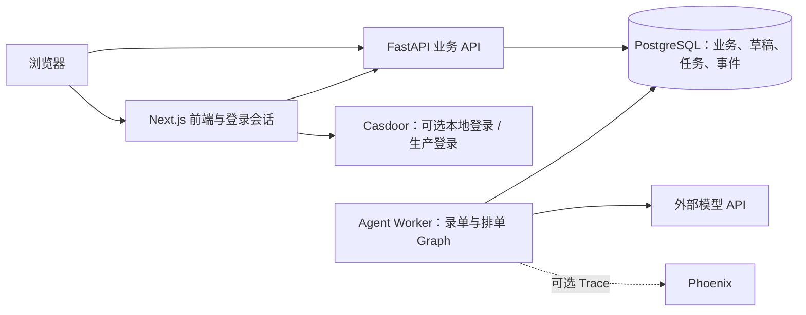

# FilmOS (ZM-OS)

面向塑料薄膜工厂的订单与生产协同系统：维护基础数据、录入订单、看板排产、跟踪生产任务，并通过 AI 截图识别和排单草案辅助操作。

## 当前架构

当前 `main` 使用前后端分离与独立 Agent Worker。API 和 Worker 共用后端代码；PostgreSQL 同时保存业务数据和持久任务队列，无需 Redis 或 OpenClaw。



- **前端**：订单、看板、截图录单和排单工作台；普通业务 API 使用 Bearer Token，Agent 请求通过 Next.js 同源代理。
- **FastAPI**：认证与授权、业务校验、任务入队、查询进度，以及用户确认后的正式建单和排产。
- **Agent Worker**：从 PostgreSQL 领取任务，运行录单/排单的 LangGraph 流程、调用模型并保存草稿与事件。浏览器断开不取消已入队任务。
- **PostgreSQL**：业务事实源；图片正文另存共享附件卷，API 和 Worker 均可访问。
- **人工确认**：AI 只准备草稿；正式业务写入由用户确认后通过后端 Service 原子执行。

服务数量（单副本）：

| 模式 | 常驻容器 | 一次性步骤 |
| --- | --- | --- |
| 默认本地 | 4：frontend、backend、postgres、agent-worker | 数据库迁移 |
| 本地 Casdoor | 5：默认四个 + casdoor | Casdoor 数据库/配置初始化、业务迁移 |
| 本地启用 Phoenix | 在所选模式上增加 1 个 phoenix | 无额外业务初始化 |
| 生产，启用 AI | 6：frontend、backend、postgres、agent-worker、casdoor、caddy | 登录初始化、备份、迁移 |

Casdoor 与 FilmOS 共用一个 PostgreSQL 容器，但使用独立数据库和账号。生产配置不包含 Redis 和 Phoenix。Caddy 提供统一入口与 HTTPS。

## 本地运行

部署目录、环境配置位置与本地/生产入口统一见[部署说明](deploy/README.md)。

需要 Git、运行中的 Docker 和 Docker Compose v2。容器部署不要求宿主机安装 Python、Node.js 或数据库。

首次准备配置（已有文件时保留并检查，不覆盖）：

```bash
cp deploy/local/.env.example deploy/local/.env
```

在该文件中填写随机 `AUTH_SECRET`；可用 `openssl rand -hex 32` 生成，只保存在本地配置中。AI 功能需在 `deploy/local/.env` 填写 `LLM_API_KEY`，并核对模型地址和文本/视觉模型名称。没有模型凭证仍可使用普通业务页面。

启动或更新：

```bash
./deploy/local/up.sh
```

脚本先校验配置和构建镜像，等待 PostgreSQL 就绪，停止已有应用写入进程，执行 Alembic 迁移，再启动 API、Worker 和前端并检查健康与数据库结构。构建失败不会停止原应用；迁移失败会保持应用停止，不删除数据卷或自动回滚。脚本不会创建账号或灌入演示数据。本地数据有保留价值时，升级前自行备份；生产必须使用生产发布脚本。

首次使用本地账号模式时，另行创建开发账号：

```bash
docker compose --env-file deploy/local/.env -f deploy/local/docker-compose.yml exec backend python scripts/seed_admin.py <email> <password>
# 可选，仅用于本地体验：
docker compose --env-file deploy/local/.env -f deploy/local/docker-compose.yml exec backend python scripts/seed_demo.py
```

打开 [http://localhost:3000](http://localhost:3000)。后端 API 文档位于 [http://localhost:8000/docs](http://localhost:8000/docs)，数据库端口为 `5432`。

首次启动或代码包含数据库迁移时使用上面的脚本，不直接使用 `docker compose --env-file deploy/local/.env -f deploy/local/docker-compose.yml up` 跳过迁移。默认 Compose 仅用于本机/受信网络，不部署到公网。停止时执行 `docker compose --env-file deploy/local/.env -f deploy/local/docker-compose.yml down`；不加 `-v`，保留数据库和附件卷。

### 可选 Casdoor 登录

按 [本地登录说明](deploy/README.md#本地-casdoor-登录) 填好环境文件，然后执行：

```bash
./deploy/local/up.sh --casdoor
```

这是同一个本地启动脚本的登录选项，额外初始化 Casdoor。无需通过 `seed_admin.py` 创建 Casdoor 账号。

### 可选 AI 追踪

```bash
./deploy/local/up.sh --phoenix
# Casdoor 模式：
./deploy/local/up.sh --casdoor --phoenix
```

该选项合并 `compose.phoenix.yml`，在 Worker 启用追踪并启动 Phoenix；API 不依赖采集器。界面仅监听 [http://localhost:6006](http://localhost:6006)，Worker 隐藏模型输入、输出和图片。详见 [可观测性说明](meta/OBSERVABILITY.md)。

关闭追踪时，以原登录模式重新运行脚本但不带 `--phoenix`，再停止采集器（保留追踪卷）：

```bash
docker compose --env-file deploy/local/.env -f deploy/local/docker-compose.yml -f deploy/local/compose.phoenix.yml stop phoenix
```

## 代码与部署入口

| 目录 | 职责 |
| --- | --- |
| `frontend/` | Next.js 页面、登录、Agent 同源代理；见 [前端说明](frontend/README.md) |
| `backend/` | FastAPI、业务 Service、SQLAlchemy、Worker；见 [后端说明](backend/README.md) |
| `backend/alembic/` | 数据库结构迁移 |
| `deploy/` | 部署总入口、脚本与配置；见 [部署说明](deploy/README.md) |
| `deploy/local/` | 本地启动与可选登录配置 |
| `deploy/production/` | 生产 Compose、发布、备份、恢复；见 [生产部署](deploy/production/README.md) |
| `meta/` | 业务事实、工程规则与架构决策；见 [文档地图](meta/README.md) |
| `.github/workflows/` | 后端、前端、Agent 联调与部署配置检查 |

生产部署使用独立配置和发布脚本，包含备份、迁移和健康检查，不自动调用付费模型。正式运行前还需人工验证登录、真实截图识别与业务操作。历史设计与验收记录见 [实施进度](meta/agent-design/implementation-status.md)，不以历史记录替代当前代码和运行验证。

## 版本与发布

日常开发在 `development`，稳定更新经 PR 合入 `main`；正式版本使用 `vMAJOR.MINOR.PATCH` 标签。开发、发布与部署步骤见 [版本发布规则](meta/RELEASING.md)。
