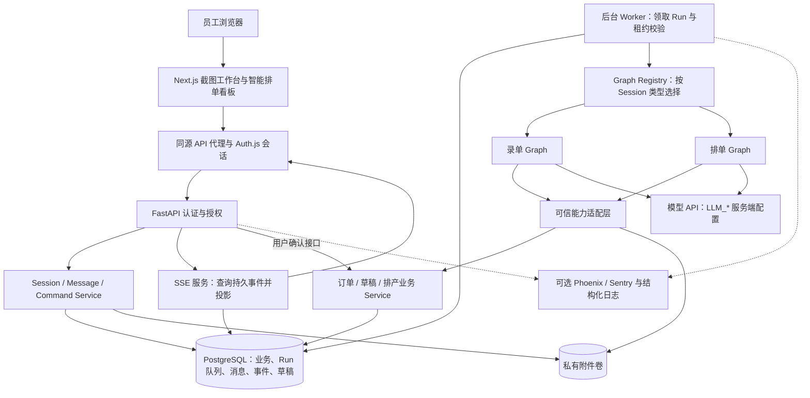
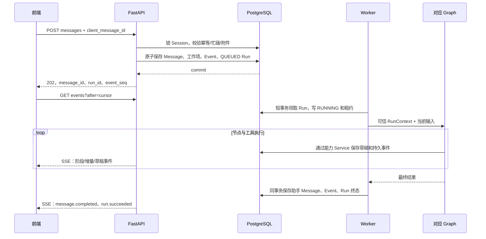
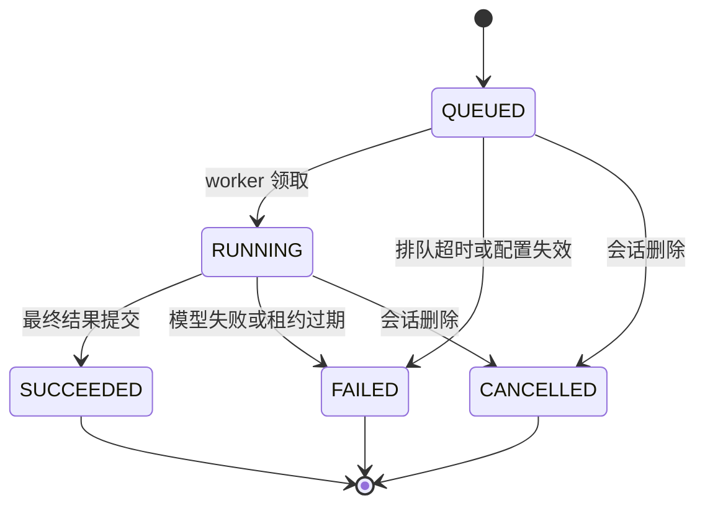
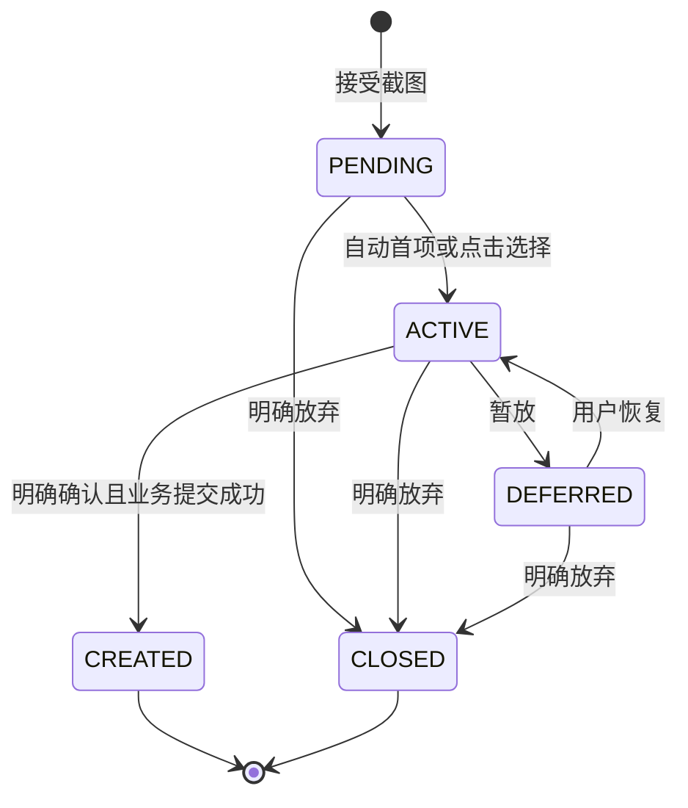
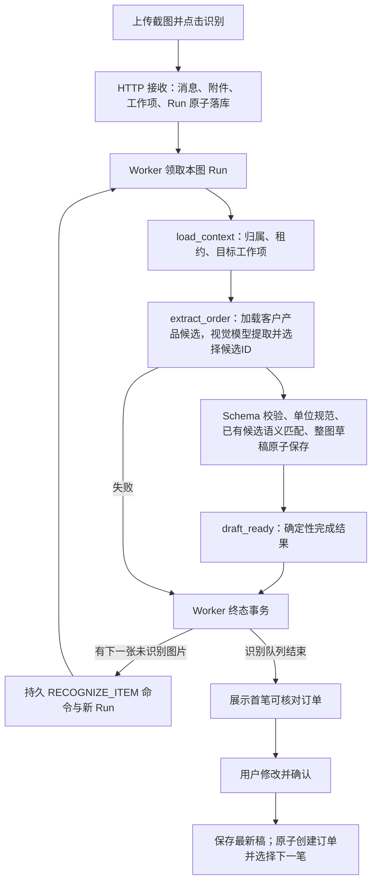

# AI 助手逻辑与工程架构

版本 1.1 · 设计基线，实际交付范围见[实施进度](implementation-status.md) · 总入口：[PRD](../PRD.md)

## 1. 术语与职责

| Term | 中文 | 定义 | 不承担的职责 |
| --- | --- | --- | --- |
| Session | 会话 | 某用户拥有、固定 Agent 类型的持久容器 | 不以某一 Run 的成功/失败作为自身状态 |
| SessionState | 会话状态 | 当前工作项/草案引用、状态版本、少量业务提示 | 不复制订单草稿、队列全表、完整消息历史 |
| Message | 消息 | 用户输入或助手最终输出；定稿后不可编辑 | 不保存工具协议消息和模型内部推理 |
| SessionEvent | 会话事件 | 有顺序的已发生事实，可含消息快照 | 不是任意代码指令，不是完整业务事件溯源系统 |
| Run | 执行实例 | 一次消息或结构化开始动作触发的图执行 | 不等于订单，不在等待人工核对时一直运行 |
| Graph Definition | 图定义 | 由代码版本控制的节点/边集合 | 不为每次输入新建定义或部署实例 |
| GraphState | 本轮状态 | 当前输入、范围判定、有限上下文、工具结果、计数 | 不作为业务草稿的最终权威存储 |
| WorkItem | 录单工作项 | 一张截图内单笔订单的处理目标，可能跨多个 Run | 不使用生产任务 ProductionTask 的名称或表 |
| OrderDraft | 订单草稿 | WorkItem 内可编辑、可不完整的结构化订单数据 | 未确认前不是正式 Order |
| SchedulePlan | 排产草案 | 基于真实业务输入生成、可人工编辑的排产建议 | 未确认前不改变实际生产队列 |
| Command | 操作请求记录 | 用户明确操作的幂等结果，包括确认/下一项/重试 | 不授权模型执行生产写入 |
| ToolCall | 工具调用 | Run 内受限能力的一次执行及结果记录 | 不等于普通 HTTP 请求或正式业务确认 |
| Skill | 任务指导 | 仓库内版本化任务说明，可组合到上下文 | 不动态安装代码，不扩大工具权限 |
| Worker | 执行工作进程 | 领取已保存 Run、调用指定 Graph、报告结果 | 不从客户端接收身份，不长期持有数据库事务 |
| Checkpoint | 框架快照 | LangGraph 支持的执行状态快照 | 不替代 Message/Event/草稿/确认幂等 |

首期 Graph 不依赖持久 checkpoint：Run 失败终止，重试创建新 Run 并加载已保存工作项，不从任意模型中间状态恢复。框架支持 thread 下的 checkpoint，但采用它需要另行设计映射与可重复副作用；此处是工程取舍，而非框架能力限制。[LangGraph 官方持久化说明](https://docs.langchain.com/oss/python/langgraph/persistence)

## 2. 工程总架构图

浏览器统一走 Next.js 同源 `/api/agent/v2` 代理，代理服务端注入已有后端身份凭证，支持上传和流式转发；FastAPI 再次完成权威认证与授权。其他业务 API 逐步沿用现有 API 层，不要求本次全仓重写。SSE 不携带 Token 在 URL 中。

API 和 worker 使用相同后端镜像与领域代码，可分角色启动。worker 访问私有附件卷，API 和 worker 均无必要公开额外端口。默认不引入 Redis、独立消息中间件或两套 Agent 微服务。API 健康不依赖模型在线；worker 状态单独观测。

## 3. 一条输入的事务与消息时序

发送 202 表示输入和执行意图已经持久化，模型可能尚未开始。commit 成功但 HTTP 响应丢失时，重用同一个 client_message_id 返回原 message/run，不重复入队。运行失败后“重试”是新 Command 和新 Run，不重发原消息。

所有聊天输入都创建一个对应 Run，包括“已有当前项时追加新截图”：该 Run 只做范围判断和排队确认，不识别队尾图片。因此消息/回复关联保持一致，又不会抢占当前工作项。结构化按钮也可创建 Run，但不伪造用户说过的话，记录 command.accepted 事件。

## 4. 状态与生命周期

### 4.1 Session / SessionState

- 类型 ORDER_INTAKE / SCHEDULING 创建后不可修改；旧 LEGACY 数据由退役迁移清理，当前接口不提供旧会话只读或执行入口。
- 状态 ACTIVE → ARCHIVED，可恢复 ACTIVE；删除转 DELETING 并终止开放 Run，清理完成后物理删除。归档不删除草稿；忙碌时归档返回冲突。
- active_work_item_id 和 active_plan_id 是后端管理引用；只允许与类型对应的字段非空。
- state_revision 是整个工作区选择/提示状态的并发版本；last_event_seq 是事件顺序，不能混作草稿版本。
- 状态输出示例：`{schema_version:1, agent_type:"ORDER_INTAKE", state_revision:7, active_work_item_id:"...", active_plan_id:null, business_state:{last_question:null}, active_run:{id:"...",status:"RUNNING"}}`。active_run、列表数量和按钮根据数据查询投影，不复制为 JSON 权威字段。

### 4.2 Run

正常追问、超范围、无待排订单均 SUCCEEDED，并以 outcome 区分。失败是执行故障。终态不重开；重试创建 retry_of_run_id 指向旧 Run 的新记录。首期不提供任意“停止并继续执行”按钮，不引入 WAITING_HUMAN Run，人工等待由草稿承担。

### 4.3 WorkItem 与草稿

ACTIVE 表示当前选择，不表示 worker 正在工作；Run 失败后工作项仍 ACTIVE；仅识别阶段失败才设置识别状态FAILED，若识别已成功但后续解释失败则保留SUCCEEDED和已保存草稿。草稿 readiness（缺字段/可提交）由 issues 推导，不另设与业务状态竞争的枚举。CREATED 必须有 order_id，CLOSED 不撤销正式订单，DEFERRED 保留截图、识别结果和人工草稿。

一个 Session 最多一个 ACTIVE 工作项。暂放/关闭仅在没有开放 Run 时允许，清空当前项并生成后端成功消息和“处理下一张”建议；不会自动识别下一项。恢复暂放项也必须没有其他 ACTIVE 项。

### 4.4 SchedulePlan

DRAFT → APPLIED / SUPERSEDED / CLOSED。stale 由输入指纹计算，不持久化成容易失真的状态枚举。一个 Session 最多一个 DRAFT；生成新草案替换时必须有一次针对旧草案版本的明确替换授权。查询和解释不会重新生成；没有待排订单的替换请求不删除原方案，返回无待排订单并提示旧草案可能已过期。

## 5. 领取、并发与失败恢复

1. 所有写入遵循短事务锁顺序：Session → Command/Run → WorkItem/Plan → 排产输入事务锁 → 业务机器/订单（按 ID 排序）。新输入先检查幂等记录，再检查开放 Run，避免重试原请求被误报忙碌。
2. 数据库部分唯一索引保证同 Session 最多一个 QUEUED/RUNNING Run。消息接受与 Run 创建同事务，不存在“消息保存了但队列任务丢了”的窗口。
3. worker 在存在 QUEUED Run 的 Session 上 `FOR UPDATE SKIP LOCKED` 领取一个，再锁 Run、改 RUNNING、写 lease_token 和 lease_expires_at。先锁 Session 保持锁顺序；提交后才调用模型。
4. 初始租约 30 秒，heartbeat 每 10 秒延长；Run deadline 180 秒不可通过心跳无限延长。短事务提交前必须检查 RUNNING、租约令牌、未过期、Session ACTIVE、目标工作项/草案仍有效。
5. 识别故障时，recognition_status/last_error_code与recognition.failed、Run失败事件在相同终态事务更新；其他阶段失败不抹掉已成功的识别。
6. worker 失联或超时：watchdog 按同一锁顺序标记 FAILED，写错误事件、清理未完成工具状态，解除忙碌；不自动重新执行整个图。用户点击重试后新 Run 从业务快照开始。
7. 旧 worker 后续返回必须被状态/租约检查拒绝写回。已在失效前提交的草稿修改保留，并以新 revision 告知下一次 Run。
8. 模型/HTTP 调用期间不持有数据库锁。不承诺 exactly-once 模型调用；正式业务效果依靠工作项/方案状态与幂等事务保证不重复。

SKIP LOCKED 适合队列表的多消费者领取，但不适合作为业务一致性校验的替代。以上 Session 锁顺序、租约与终态策略是本项目设计。[PostgreSQL 16 SELECT 锁语义](https://www.postgresql.org/docs/16/sql-select.html)

## 6. 录单 Agent

### 6.1 当前工作台 Graph

F 是 extract_order 注入能力内部步骤，不另构造嵌套 Graph。每张图在同一次视觉调用中提取订单并选择客户/产品候选，不另调用文本匹配模型；模型调用期间不持有数据库锁。动态 Schema 同时作为输出说明和后端校验模型。最多一次格式纠错重试；若仅候选选择字段仍无效，清空对应选择并保存其他有效信息，提示手选。固定按钮路径不调用 admittance、main_agent 或解释模型；没有自主正式创建权限。1～20笔独立草稿在同一事务保存。

### 6.2 识别与核对分离

- Session 同时只有一个开放 Run；Run.work_item_id 表示本轮识别目标，Session.active_work_item_id 表示当前核对目标，两者在工作台允许不同。
- Worker 的身份、Session ACTIVE、Run状态/归属、租约令牌和deadline仍须全部通过。仅服务端记录的 intake_workbench 配置允许后台处理非当前项。
- 终态与后继图片入队在一个事务内完成。失败图保留重试入口，自动接续仅选择下一张尚未识别图，不反复重跑失败图；版本冲突也按失败收敛。
- 切换前保存草稿。正式确认通过后端确定性命令执行，advance=true 将下一笔已识别 PENDING 项设为 ACTIVE，跳过暂放和失败项。
- 现有专用 Session 文本 API 仍保留受限 admittance/main_agent/tools/compose 路径供内部兼容，工作台无文字发送入口。旧 LEGACY 会话与旧图保持退役。

### 6.3 输入与工具权限

图片识别是确定性前置编排中的模型调用，不向 Main Agent 开放“任意重新识别并覆盖”能力。新 Run 遇到 recognition_status=SUCCEEDED 时直接复用原始结果和最新草稿，除非显式重试识别且草稿尚未手改；有手改时只返回识别建议，不覆盖。

| 工具 | 允许参数 | 执行权限 |
| --- | --- | --- |
| read_current_draft | 无 | 只读已绑定 work_item_id |
| search_customers | query、limit≤10 | 查询已有客户，不创建 |
| search_products | query、category_id?、limit≤10 | 查询已有产品 |
| list_formulas | product_id、limit≤10 | 查询兼容的已有配方 |
| update_order_draft | expected_revision、白名单 patch | 修改当前未提交草稿；禁止业务状态/来源/订单 ID |
| validate_order_draft | 无 | 重新计算问题清单，不创建正式订单 |

RuntimeContext 注入 user_id、session_id、run_id、work_item_id、lease_token。模型不能选择这些 ID。formula_mode 仅 none/existing；查不到基础数据时引导维护，不通过工具创建。

Skills 为代码中的 ORDER_SKILL（版本 2） 的截图识别解释、字段补充与草稿核对指导。提取 Prompt 独立于对话 Prompt；模型和 Prompt 版本写入 Run config_snapshot。

## 7. 排单 Agent

### 7.1 当前工作台 Graph

当前按钮路径与消息流见[智能排单看板](scheduling-workbench.md)。可信结构化选单动作直接进入 load_context → generate_plan → explain_workbench → finalize。规则服务产生权威草稿，LLM 只给实际方案补充最多三句说明；说明失败仍保留草稿。仅旧文本 API 路径保留 admittance、main_agent 和受限工具循环，前端不提供该聊天入口。

### 7.2 排产执行原则

- 查询读取 Service 的真实数据；生成时 Service 重新加载订单与机器输入，不能用模型自行拼造的订单列表直接写方案。
- 每 Run 最多生成一份草案；节点与工具若重复请求生成，返回已保存的 generated_plan_id，不反复替换。
- 新生成只在结构化开始排单动作、文本 GENERATE 或 REPLACE_PLAN Command 下开放；已存在 DRAFT 时必须携带旧 plan_id+revision 的替换授权。模型不能制造这个授权。
- 替换生成时先计算，再在短事务内复查旧版本、保存新草案并将旧草案 SUPERSEDED。失败保留旧草案。
- 计算可在数据库事务外使用一致快照，保存/执行时重新验证输入指纹。大结果要分页或结构化汇总给模型，但真实草案不能按上下文长度截断丢单。
- 业务规划以确定性服务为准。模型可以解释合并、机器选择和未安排原因，不计算权威队列、不修改优先级、不声称已执行。

| 工具 | 参数 | 权限 |
| --- | --- | --- |
| read_board | 无（后端分页聚合） | 读取当前待排订单和实际机器队列摘要 |
| read_draft | 无 | 当前 Session 的最新草案含人工修改与 stale 标记 |
| generate_draft | 无 | 仅本轮生成授权有效时调用，最多一次，不能执行 |

保留三项能力名称与现有方向一致。Skills 为代码中的 SCHEDULING_SKILL（版本 1） 的方案解释、未安排原因、人工调整与确认指引；无自然语言调整工具。

## 8. 上下文、模型、事件与 Middleware

Main Agent的规划文字只在本轮内使用，不写成聊天Message。进入compose_response后不再调用工具，以事实结果生成最终解释；这是每轮最多一次额外模型调用，独立计入Run总预算。范围拒绝、排队确认、无待排与正式业务成功使用模板，可跳过该模型调用。

文本请求顺序：身份/租约检查 → 上下文加载 → 范围判定 → 领域流程 → 工具边界检查 → 回复与审计。admittance 只调用一次轻量模型，图片只传存在性/当前工作状态，不为判断范围重复做 OCR。已知 NEXT_ITEM/RETRY/REPLACE_PLAN Command 可由确定规则通过范围检查。

上下文包含：固定 Agent Prompt、所选 Skills、当前消息、当前项原始证据摘要、最新草稿与 issues、同工作项相关历史、近期安全会话摘要。不能把所有 SessionEvent 全量作为聊天历史；其他工作项的规格不可注入为当前项默认值。模型可见来源证据需标识为数据。

工程初始上下文预算 24000 token，保留 4000 token 输出余量并受模型实际窗口限制；优先保留当前草稿、当前消息和系统规则，裁减旧聊天/工具明细。后台匹配使用数据库分页检索，不把客户/产品全表写入 Prompt。用户原始消息和附件不会因截断上下文而从数据库删除。

公共 Middleware：输入 Schema、token/时间预算、调用次数、工具 allowlist、版本与 lease 校验、模型 usage 聚合、事件记录、错误脱敏。Prompt 不存凭证，不持久化模型内部推理；意图只保存结构化结论与简短原因代码。

正式业务确认由 API 短事务完成，不依赖 Main Agent 回复。如果模型故障，用户仍可核对保存好的草稿并确认；Run 必须已终止且版本有效。

## 9. 删除、归档与审计边界

删除 Session 是用户明确操作：同事务标记 DELETING、取消开放 Run、写附件清理作业；后台删除私有文件，成功后清理会话消息、事件、草稿与 Run。失败留 DELETING 并重试，不能对外报告已彻底删除。期间拒绝读取内容和新增输入，worker 迟到写入被拦截。

正式 Order/ProductionTask 不随会话删除；长期审计仅保留用户、动作、正式对象 ID 与结果，session_id 置空，不保存截图/正文。会话事件可删除；它们不替代长期业务审计。工作项 CLOSED 是逻辑退出，不承担数据清理。附件暂存回收和会话删除文件任务通过同一持久 GC 机制处理。

## 10. 排产输入的跨入口并发契约

首期单工厂采用一个固定命名空间的PostgreSQL事务级advisory lock，覆盖所有影响排产输入的短业务写事务：订单创建/规格数量修改/删除、机器启用和能力变化、生产任务创建/移动/完成/删除，以及Agent排产确认。普通页面和Agent调用同一Service锁协议。

锁顺序为Session（如果有）→Command/Run→工作项/草案→排产输入锁→机器/订单行锁；普通业务入口从排产输入锁开始，不能反向获取Session锁。确认排产在持锁后重新读取完整输入集合与指纹，再校验并提交全部任务，避免只锁已有订单而漏掉新插入待排订单的竞争窗口。

生成建议只读取一致快照，不在模型计算期间持锁；生成保存的草案可以随后变旧，确认时必须再次验证。已有Service若尚未采用共享锁，属于本次实施依赖，不能只修Agent入口就宣称满足并发保证。此锁只串行化短暂业务写事务，不串行化不同Session的模型运行；工厂规模扩大后再评估更细粒度策略。

## 11. 当前代码职责地图（2026-09-13）

| 路径 | 职责与边界 |
| --- | --- |
| frontend/components/agent/AgentShell.tsx | 布局、工作项选择与编辑器组装；页面按 Session ID 提供 key |
| frontend/components/agent/useAgentComposer.ts | 未发送输入、上传标识与附件缓存、同消息 ID 重试；缓存不通过修改 React state 对象更新 |
| frontend/components/agent/useSessionDirectory.ts | 首页会话列表与会话生命周期操作 |
| frontend/components/agent/useAgentOperation.ts | 当前 Shell 内跨操作的同步互斥与错误展示状态 |
| frontend/components/agent/AgentConversation.tsx | 历史分页、消息与执行进度展示，接收权威快照 |
| frontend/components/agent/AgentComposer.tsx | 输入区、图片选择及待发送预览 |
| backend/app/schemas/agent/order_extraction.py | 仅校验模型 v2 的类型、枚举、数值边界及证据一致性 |
| backend/app/services/order_extraction_normalizer.py | 已校验数值 → Decimal 换算 → 草稿字段及推测提示；不读取数据库或重新解析原文 |
| backend/app/services/legacy_order_extraction.py | 历史 v1 证据的兼容转换；新模型响应不进入此路径 |
| backend/app/services/order_matching_service.py | 有界查询已有客户/产品/配方，将唯一匹配补入规范化草稿 |
| backend/app/services/order_draft_service.py | 草稿补丁合并和业务字段验证，不提交事务 |
| backend/app/services/order_recognition_service.py | USER 来源保护、独立工作项、识别结果和事件在工具事务内一起保存 |
| backend/app/services/order_intake_item_service.py | 草稿更新、工作项切换/暂放/放弃、正式订单确认；用例统一提交 |
| backend/app/services/agent_query_service.py | 授权读取、分页、事件补读与一致快照；快照短锁完成后释放事务 |
| backend/app/services/agent_projections.py | ORM 对象的明确响应字段投影，不执行查询或业务命令 |
| backend/app/services/agent_session_service.py | 会话授权及版本约束、接收消息、入队、重试与生命周期命令 |

数据库结构、HTTP 字段、Graph 节点和人工确认边界保持原契约。草稿仍采用既有规格字符串和精确数量字符串存储；“直接转换”指绕开旧文本提取解析，并不新增另一套草稿事实源。

### 工作台组件与用例

OrderWorkbench 负责页面组合、选择与上传；OrderIntakeList 负责截图分组和状态筛选；OrderSourceImage 负责原图缩放；RecordingHistory 负责记录读取；OrderDraftEditor 负责工作项版本与确认，OrderForm 仍是普通页面/草稿唯一表单组件。全局 Sidebar 不再加载会话目录，排单通过顶部入口切换会话。

后端 order_intake_workflow 仅处理 Run 终态接续与下一个核对目标，调用方持有 Session 锁并控制 commit；order_recognition_service 继续负责整图草稿原子应用，order_intake_item_service 继续负责确认/暂放/放弃/选择。既有授权查询与 DTO 投影提供列表名称及全量计数，不增设同义模型或通用流程框架。

2026-09-13 客户/产品视觉匹配：每次识别读取数据库中的客户ID/名称、产品ID/名称/大类，作为独立候选数据送入视觉调用。提示词只保留任务、客户、产品、选择、数值、输出六段。客户结合顶部群名与下单者昵称判断，不把被@的供货/接收方直接当客户；产品允许简称、俗称与通用类别，明确材料/颜色冲突不得忽略。context_text 保存群名/发送者原文，每单 customer_match/product_match 返回候选ID、自评分、次选评分、证据和理由，未知为null。运行时Schema按当前候选ID生成 enum/const，空候选只能null；随后核验原文引用、自评分≥0.90、领先次选≥0.15及同名歧义。这些评分门槛尚未校准，不代表准确率。原有唯一明确名称匹配保留，语义建议写回前再次检查基础数据ID/名称，人工值和明确清空优先；ENTITY_INFERRED 保留推测依据，产品原始描述进入备注。每类候选上限50条、序列化UTF-8上限8000字节，超限该类不做语义预填并提示手选，不静默截取前50条；大目录检索尚未实现。

排单工作台代码分工和选单范围指纹见[智能排单看板](scheduling-workbench.md)。旧 AgentConversation、AgentComposer、SchedulingPlanEditor、ProductionOverview 展示组件已被新的看板替代。
