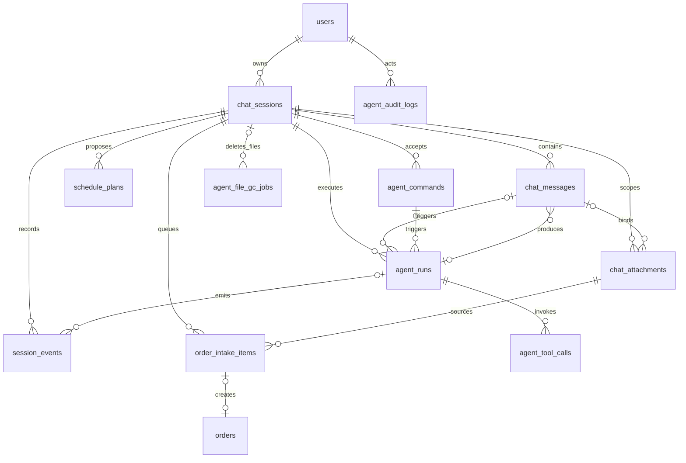

# AI 助手数据库设计

版本 1.0 · 目标 Schema，不代表现有数据库 · 总入口：[PRD](../PRD.md)

## 1. 范围与建模约定

本模块涉及 **11 张表：改造 5 张现有表，新增 6 张表**。订单、生产任务、用户、客户、产品、机器、配方继续复用现有业务表，不另建 Agent 专用业务副本。

| 表 | 动作 | 用途 |
| --- | --- | --- |
| chat_sessions | 改造 | 会话类型、归属、当前工作区、顺序与版本 |
| chat_messages | 改造 | 不可编辑的定稿消息 |
| chat_attachments | 改造 | 多图上传暂存与消息附件 |
| agent_runs | 新增 | 持久任务队列、执行状态与租约 |
| session_events | 新增 | 有序会话事实、文本快照、流式事件 |
| order_intake_items | 新增 | 截图内单笔订单的处理工作项与草稿 |
| agent_commands | 新增 | 按钮与控制操作幂等 |
| agent_tool_calls | 新增 | 工具开始、结果、错误与去重 |
| agent_file_gc_jobs | 新增 | 私有文件可靠删除队列 |
| schedule_plans | 改造 | 排产草案版本、替换与执行结果 |
| agent_audit_logs | 改造 | Run 摘要与长期业务确认审计 |

ID 沿用现有服务端不透明字符串生成器，SQL 类型 text，不在本次同时迁移业务 ID 为 UUID。所有时间 timestamptz；JSON 使用 JSONB；正数版本使用 bigint；金额/数量草稿计算使用 Decimal，JSON 中精确数值以十进制字符串传输。表中“可空=否”意味着 NOT NULL。结构化JSON对象使用schema_version；集合与字段映射由所属DTO/记录版本定义。所有JSON都有Pydantic类型与大小上限，不是任意字段容器。

可演进的 Agent 枚举采用 text + 命名 CHECK，并在 Python 使用 str Enum；现有 PostgreSQL 原生 enum 的转换必须由 Alembic 完成，不能只改 ORM。所有新表建表/改表均经 Alembic，不由应用启动 setup。

## 2. 实体关系图



Session 与 Run/Message/工作项之间多个引用可能形成 DDL 环：先建基础表，再 ALTER 添加约束，按 migration 顺序处理。跨会话引用禁止；下文业务约束需要数据库复合外键与 Service 校验共同实现。

## 3. 枚举字典

| 名称 | 全部取值 | 说明 |
| --- | --- | --- |
| AgentType | ORDER_INTAKE, SCHEDULING, LEGACY | LEGACY 仅为旧库迁移识别值；迁移删除其记录，所有 API 拒绝 |
| SessionStatus | ACTIVE, ARCHIVED, DELETING | 忙碌由开放 Run 查询，不放进 SessionStatus |
| MessageRole | user, assistant, system | 新业务只产生前两种；system 用于迁移公告 |
| MessageOrigin | USER, AGENT, BUSINESS, MIGRATION | 区分模型回复与实际业务成功消息 |
| AttachmentStatus | STAGED, BOUND | 删除由 GC 作业，不复用上传状态 |
| RunStatus | QUEUED, RUNNING, SUCCEEDED, FAILED, CANCELLED | 终态不可反向迁移 |
| RunTrigger | MESSAGE, NEXT_ITEM, RESUME_ITEM, RETRY, REPLACE_PLAN | RETRY 保留原输入引用 |
| RunOutcome | ANSWERED, NEEDS_INPUT, OUT_OF_SCOPE, QUEUED_ONLY, DRAFT_READY, NO_PENDING, NO_FEASIBLE, LIMIT_REACHED | 仅 SUCCEEDED 非空 |
| WorkItemStatus | PENDING, ACTIVE, DEFERRED, CREATED, CLOSED | 每 Session 最多一个 ACTIVE |
| RecognitionStatus | NOT_STARTED, SUCCEEDED, FAILED | 识别是否运行由 Run/Event 表示 |
| SchedulePlanStatus | DRAFT, APPLIED, SUPERSEDED, CLOSED | stale 为实时计算属性 |
| CommandKind | ARCHIVE_SCREENSHOT, RESTORE_SCREENSHOT, RECOGNIZE_ITEM, CREATE_SESSION, NEXT_ITEM, SELECT_ITEM, DEFER_ITEM, CLOSE_ITEM, CONFIRM_ORDER, APPLY_PLAN, REPLACE_PLAN, CLOSE_PLAN, RETRY_RUN, ARCHIVE_SESSION, RESTORE_SESSION, DELETE_SESSION | 接口 operation 映射，不接受任意字符串执行 |
| ToolCallStatus | STARTED, SUCCEEDED, FAILED, ABANDONED | 失联后未完成调用为 ABANDONED |
| GcStatus | PENDING, RUNNING, SUCCEEDED, FAILED | FAILED 按重试计划重新领取 |
| AuditKind | RUN_FINISHED, ORDER_CREATED, SCHEDULE_APPLIED | 业务写入记录与原事务同提交 |
| ActorKind | USER, AGENT, SYSTEM | 事件来源，不替代权限 |

SessionEvent.kind 使用下列封闭集合，每次扩展必须同步 Schema 和客户端：

```text
session.created             session.archived            session.restored
session.deleting            session.state_changed
message.accepted            message.completed
command.accepted
run.queued                  run.started                 run.progress
run.succeeded               run.failed                  run.cancelled
admittance.decided
work_item.queued            work_item.activated         work_item.deferred
work_item.closed            work_item.created
recognition.completed       recognition.failed
draft.updated               plan.generated              plan.updated
plan.superseded             plan.closed                 plan.applied
tool.started                tool.succeeded              tool.failed
tool.abandoned              assistant.delta
```

事件 kind、API 错误码和字段问题码是不同命名空间；不得将任意异常类名当 event kind。

## 4. 表字段

### 4.1 chat_sessions（改造）

| 字段 | 类型 | 可空 | 默认/约束与含义 |
| --- | --- | --- | --- |
| id | text | 否 | PK，服务端生成 |
| user_id | text | 是 | FK users.id，RESTRICT；非LEGACY强制非空，旧库无主会话由退役迁移删除 |
| agent_type | text | 否 | AgentType；新建后不可变 |
| status | text | 否 | ACTIVE，SessionStatus |
| title | varchar(120) | 否 | 服务端默认，可独立改标题但不改变消息 |
| state_schema_version | smallint | 否 | 1 |
| state_revision | bigint | 否 | 1，>0，工作区状态更新递增 |
| state | jsonb | 否 | 按类型校验，默认 `{}`，≤16 KiB；只存提示信息 |
| active_work_item_id | text | 是 | 当前项引用，只能用于 ORDER_INTAKE |
| active_plan_id | text | 是 | 当前草案引用，只能用于 SCHEDULING |
| last_event_seq | bigint | 否 | 0，≥0；事务中分配事件 seq |
| created_at | timestamptz | 否 | now() |
| updated_at | timestamptz | 否 | now()，成功接受/状态变化更新 |
| archived_at | timestamptz | 是 | 仅 ARCHIVED |
| deletion_requested_at | timestamptz | 是 | 仅 DELETING |

索引 `(user_id,status,updated_at DESC,id)`；复合 FK `(active_work_item_id,id)` → items `(id,session_id)`，plan 同理；清空指针后才能删除子记录。state 中禁止另存 active ID、run 状态、完整草稿或工作项数组。开放 Run 与计数由查询生成 SessionState DTO。

### 4.2 chat_messages（改造）

| 字段 | 类型 | 可空 | 默认/约束与含义 |
| --- | --- | --- | --- |
| id | text | 否 | PK |
| session_id | text | 否 | FK Session CASCADE |
| client_message_id | text | 是 | 用户消息必填；客户端 UUID，不作为权限凭证 |
| request_hash | char(64) | 是 | 用户消息规范化文本+有序附件 ID 的 SHA256 |
| role | text | 否 | MessageRole |
| origin | text | 否 | MessageOrigin |
| content | text | 否 | 图片用户消息允许空串，用户≤10000 字，助手≤20000 字 |
| content_schema_version | smallint | 否 | 1 |
| presentation | jsonb | 是 | ≤128 KiB，只读卡片/结构化 action 描述 |
| run_id | text | 是 | 产生回复的 Run；用户消息通常 NULL |
| command_id | text | 是 | 业务/API 模板回复所属 Command |
| work_item_id | text | 是 | 单项续聊或回复对象；批量上传消息可为空 |
| event_seq | bigint | 否 | 对应 accepted/completed 事件序号，提交时分配 |
| created_at | timestamptz | 否 | now()；无内容 updated_at，定稿不可编辑 |

唯一 `(session_id,client_message_id)` WHERE 非空；唯一 `(run_id)` WHERE origin=AGENT（每 Run 最终回复最多一条）；唯一 `(command_id)` WHERE origin=BUSINESS（每确认动作成功回复最多一条）。索引 `(session_id,event_seq,id)`、work_item_id。旧 tool_calls/is_pending/tool_name/tool_call_id 迁移后移出新表活跃契约，旧展示内容见迁移文档。

run_id/command_id/work_item_id 与 session_id 以复合 FK 保证同会话。SessionEvent.message_id 关联本表；避免再建 message.event_seq → Event 的循环 FK，只保留唯一 seq 与事务校验。

### 4.3 chat_attachments（改造）

| 字段 | 类型 | 可空 | 默认/约束与含义 |
| --- | --- | --- | --- |
| id | text | 否 | PK |
| session_id | text | 否 | FK Session CASCADE，上传时即绑定所有权范围 |
| message_id | text | 是 | STAGED 为空；BOUND 必须非空，复合 FK 同 Session |
| client_upload_id | text | 否 | 上传幂等 ID，唯一 `(session_id,client_upload_id)` |
| position | smallint | 是 | BOUND 时 0..4，唯一 `(message_id,position)` |
| status | text | 否 | AttachmentStatus，默认 STAGED |
| mime_type | varchar(32) | 否 | image/jpeg 或 image/png，真实解码验证 |
| byte_size | bigint | 否 | >0 且≤5242880 |
| width_px / height_px | integer 各一列 | 是 | 新上传必填，>0，乘积≤20000000；历史不可用文件可同时为空 |
| sha256 | char(64) | 是 | 新上传必填；旧缺失文件允许NULL。防上传重试换内容，不做跨用户去重授权 |
| storage_key | text | 否 | 唯一，相对私有卷随机路径，不返回客户端 |
| available | boolean | 否 | true；迁移发现旧文件不可用为false，不能作为新图输入 |
| created_at | timestamptz | 否 | now() |
| expires_at | timestamptz | 是 | STAGED 默认创建后24h，BOUND 设 NULL |

取消现有 message_id 唯一限制；改为多附件有序集合。索引 `(status,expires_at)`、session_id。消息接受事务锁附件并将 STAGED→BOUND；同一附件不能绑定第二条消息。只支持 ORDER_INTAKE，Service 强校验。

### 4.4 agent_runs（新增）

| 字段 | 类型 | 可空 | 默认/约束与含义 |
| --- | --- | --- | --- |
| id / session_id | text 各一列 | 否 | PK / Session FK CASCADE |
| trigger_kind | text | 否 | RunTrigger |
| trigger_message_id | text | 是 | MESSAGE/消息重试的输入引用 |
| trigger_command_id | text | 是 | 按钮/重试动作引用 |
| work_item_id | text | 是 | 本轮处理项；工作台后台识别目标可与当前核对项不同；QUEUED_ONLY 可为空 |
| retry_of_run_id | text | 是 | 同 Session 旧失败 Run，SET NULL 用于清理 |
| status | text | 否 | QUEUED |
| outcome | text | 是 | RunOutcome，SUCCEEDED 才非空 |
| input_event_seq | bigint | 否 | 本轮输入边界；上下文不读后续消息 |
| graph_key | varchar(64) | 否 | order_intake 或 scheduling |
| graph_version | varchar(128) | 否 | 发布版本/代码 SHA |
| config_snapshot | jsonb | 否 | 模型 ID、prompt/skill/tool registry 版本及限额，无凭证 |
| context_snapshot | jsonb | 是 | 工作项/草案 revision、使用的 message_ids、裁剪统计；不复制图片 |
| output_message_id | text | 是 | 最终助手 Message，同 Session |
| generated_plan_id | text | 是 | 本轮已生成草案，重复调用返回同一对象 |
| error_code | varchar(64) | 是 | FAILED 必填，安全代码 |
| error_message | varchar(500) | 是 | 安全中文，不含上游正文 |
| worker_id | varchar(128) | 是 | 领取方标识 |
| lease_token | text | 是 | 每次领取新随机值，不返回浏览器 |
| lease_expires_at | timestamptz | 是 | RUNNING 必填 |
| heartbeat_at | timestamptz | 是 | 最近续租 |
| deadline_at | timestamptz | 是 | started_at+Run 时间上限 |
| model_call_count / tool_call_count | integer 各一列 | 否 | 0，非负 |
| prompt_tokens / completion_tokens / total_tokens | bigint 各一列 | 是 | 未知保持 NULL，不冒充 0 |
| queued_at | timestamptz | 否 | now() |
| started_at / finished_at | timestamptz 各一列 | 是 | 终态必须 finished_at |

唯一 `(session_id)` WHERE status IN ('QUEUED','RUNNING')；索引 `(status,queued_at,id)`、`(status,lease_expires_at)`、trigger_message_id、retry_of_run_id。MESSAGE 必须有 trigger_message_id；其他 trigger 必须有 trigger_command_id；RETRY 可同时引用旧消息与新命令。唯一 trigger_command_id WHERE 非空，防重复创建执行。

SUCCEEDED/FAILED/CANCELLED 不改变原输入，不再次领取；用户重试创建新行。新 Run 执行不靠重新插入 Message。模型调用多次 usage 聚合，缺失部分标记 config/context 中 usage_complete=false，不将部分数据声称总成本。

### 4.5 session_events（新增）

| 字段 | 类型 | 可空 | 默认/约束与含义 |
| --- | --- | --- | --- |
| id / session_id | text 各一列 | 否 | PK / Session FK CASCADE |
| seq | bigint | 否 | >0，同 Session 单调递增、唯一 |
| kind | varchar(64) | 否 | 第3节事件集合 |
| schema_version | smallint | 否 | 1 |
| actor_kind | text | 否 | ActorKind |
| actor_user_id | text | 是 | USER 时必填，FK users RESTRICT |
| run_id / message_id / command_id / work_item_id | text 各一列 | 是 | 同 Session 复合 FK；用于关联，不拼进文本 |
| tool_call_id | text | 是 | agent_tool_calls.id，同 Session 约束 |
| payload | jsonb | 否 | 分 kind 校验，≤128 KiB；正文快照/结果摘要 |
| created_at | timestamptz | 否 | now() |

唯一 `(session_id,seq)`；索引 `(run_id,seq)`、`(session_id,kind,seq)`、message_id。分配 seq 与修改 Session.last_event_seq 同事务；同一事务多个事件分配连续区间。事件不可原地编辑，会话删除是清理例外。

message.accepted/completed payload 必含 role、text、attachment_ids（可空列表），完整定稿文字以快照保存；assistant.delta 仅含 run_id 关联及 text/chunk_index，不能当最终消息。节点开始等用 run.progress，工具长结果存 ToolCall，事件仅返回安全摘要/引用。

### 4.6 order_intake_items（新增，包含草稿，不另建空转 draft 表）

| 字段 | 类型 | 可空 | 默认/约束与含义 |
| --- | --- | --- | --- |
| id / session_id | text 各一列 | 否 | PK / Session FK CASCADE |
| source_message_id / source_attachment_id | text 各一列 | 否 | 同会话；一张附件可关联多个工作项，唯一 `(source_attachment_id,source_order_index)` |
| source_order_index | integer | 否 | 1～20，截图内订单序号，历史项迁移默认 1；唯一 `(session_id,queue_position,source_order_index)` |
| queue_position | bigint | 否 | >0，表示截图顺序；与 source_order_index 共同排序，Session 锁下追加 |
| status | text | 否 | PENDING，WorkItemStatus |
| revision | bigint | 否 | 1，任何草稿/状态变化递增 |
| recognition_status | text | 否 | NOT_STARTED |
| extraction | jsonb | 是 | RawOrderExtraction v1，≤64 KiB，原始证据 |
| draft | jsonb | 否 | OrderDraft v1，默认空字段，≤64 KiB |
| issues | jsonb | 否 | `[]`，FieldIssue[]，≤100 项 |
| provenance | jsonb | 否 | `{}`，字段来源 USER/EXTRACTION/MATCH 与来源引用 |
| order_id | text | 是 | 正式 orders.id FK RESTRICT，唯一，CREATED 必填 |
| last_error_code | varchar(64) | 是 | 最近识别故障，无上游正文 |
| created_at / updated_at | timestamptz 各一列 | 否 | now() |
| activated_at / deferred_at / closed_at / completed_at | timestamptz 各一列 | 是 | 对应状态最近转换时间 |

唯一 `(session_id)` WHERE status='ACTIVE'；索引 `(session_id,status,queue_position)`。CREATED iff order_id 非空，其他状态 order_id 必须空；删除会话清理工作项不删除 orders。外键不能以 CHECK 完成跨行验证：attachment 必须 BOUND 且属于 source_message_id，接受事务按复合引用校验。

### 4.7 agent_commands（新增）

| 字段 | 类型 | 可空 | 默认/约束与含义 |
| --- | --- | --- | --- |
| id | text | 否 | PK |
| user_id | text | 否 | FK users RESTRICT |
| session_id | text | 否 | Session FK CASCADE；CREATE_SESSION 在同事务先生成会话再绑定 |
| idempotency_key | varchar(128) | 否 | 客户端每逻辑动作随机 ID |
| kind | text | 否 | CommandKind |
| request_hash | char(64) | 否 | 方法、目标路径、规范化 body 的摘要 |
| payload | jsonb | 否 | 已校验命令参数快照，≤16 KiB，不含正文/图片/凭证，供worker与重试核实 |
| target_id | text | 是 | 服务端校验工作项/Run/Plan ID |
| expected_revision | bigint | 是 | 草稿类动作必填 |
| result_run_id | text | 是 | 动作产生的 Run，同 Session |
| http_status | smallint | 否 | 已提交的响应状态，200/201/202/204 |
| result | jsonb | 否 | 原始安全响应，≤128 KiB，不含凭证/图片正文 |
| created_at | timestamptz | 否 | now() |

唯一 `(user_id,idempotency_key)`。仅保存成功提交的命令结果，不创建可无限悬挂的处理中命令行；数据库事务未提交即整体不存在。相同 key+相同 hash 返回既有结果，相同 key+不同 hash 返回409。并发唯一冲突后回滚并读取胜出记录。幂等记录保留至会话删除；对象状态约束是第二道防线。

### 4.8 agent_tool_calls（新增）

| 字段 | 类型 | 可空 | 默认/约束与含义 |
| --- | --- | --- | --- |
| id / session_id / run_id | text 各一列 | 否 | PK / 同会话 FK / Run FK CASCADE |
| call_key | varchar(128) | 否 | 模型 tool_call_id 或固定节点操作键 |
| tool_name | varchar(64) | 否 | 当前Agent工具白名单或明确注册的内部操作名（extract_order等），模型只见工具子集 |
| status | text | 否 | STARTED，ToolCallStatus |
| args_hash | char(64) | 否 | 规范参数 hash |
| args | jsonb | 否 | ≤64 KiB，已校验，敏感 ID/业务值受会话授权 |
| result | jsonb | 是 | ≤256 KiB，安全结构化工具结果；大对象只存引用/汇总 |
| error_code | varchar(64) | 是 | FAILED/ABANDONED 安全原因 |
| started_at / finished_at | timestamptz 各一列 | started 否，finished 是 | 时延依据 |

唯一 `(run_id,call_key)`；索引 `(session_id,run_id,started_at)`。同 key 不同 args_hash 拒绝。工具 STARTED 独立短事务提交；草稿副作用、成功 result 和事件同事务提交，重放同 key 返回保存结果。跨 Run 重试仍须检查工作项 revision/已有识别结果，不能只靠 call_key。

### 4.9 agent_file_gc_jobs（新增）

| 字段 | 类型 | 可空 | 默认/约束与含义 |
| --- | --- | --- | --- |
| id | text | 否 | PK |
| session_id | text | 是 | Session FK SET NULL，清理会话后可保留安全作业结果 |
| attachment_id | text | 是 | 清理目标 ID 快照，非强 FK，元数据删除后仍能重试 |
| storage_key | text | 否 | 私有随机路径，唯一 |
| status | text | 否 | PENDING，GcStatus |
| attempts | integer | 否 | 0，≥0 |
| next_attempt_at | timestamptz | 否 | now()，失败指数退避最高1小时 |
| lease_expires_at | timestamptz | 是 | RUNNING 用于失联重领 |
| last_error_code | varchar(64) | 是 | 安全错误码，不保存完整文件系统异常 |
| created_at / updated_at | timestamptz 各一列 | 否 | now() |
| completed_at | timestamptz | 是 | SUCCEEDED 必填 |

索引 `(status,next_attempt_at)`。文件不存在视为删除成功；不删除私有根目录外文件。上传文件成功但元数据事务失败，先同步补偿删除；补偿失败生成 GC 作业；数据库也不可用时由周期孤儿文件扫描兜底（24小时宽限，不删除最近写入或有元数据引用的文件）。

### 4.10 schedule_plans（改造）

| 字段 | 类型 | 可空 | 默认/约束与含义 |
| --- | --- | --- | --- |
| id / session_id | text 各一列 | 否 | PK / Session FK CASCADE |
| created_by_id | text | 否 | FK users RESTRICT |
| created_by_run_id | text | 是 | 新图生成必填，历史可空 |
| status | text | 否 | DRAFT，扩展 SchedulePlanStatus |
| revision | bigint | 否 | 1，新 v2 契约使用整数；旧 hash revision 不混用 |
| input_order_ids | jsonb | 否 | Order ID[] |
| input_fingerprint | jsonb | 否 | 待排集合、内容、机器能力与队列指纹，schema_version=1 |
| tasks | jsonb | 否 | ScheduleTaskDraft[]，由 Service 校验后写入 |
| unassigned | jsonb | 否 | UnassignedOrder[] |
| applied_result | jsonb | 是 | plan_id、task_ids、task_count、order_count；历史未知用 `{schema_version:1,legacy_result_unknown:true}` |
| superseded_by_id | text | 是 | 同 Session 后继草案 FK |
| created_at / updated_at | timestamptz 各一列 | 否 | now() |
| applied_at / closed_at | timestamptz 各一列 | 是 | 相应终态时间 |

唯一 `(session_id)` WHERE status='DRAFT'；索引 created_by_id、created_by_run_id。新图每 Run 最多一份 plan（新记录 created_by_run_id 唯一）。APPLIED 必须 applied_result/applied_at 非空。task/order 关系仍由生产业务表负责，JSON 草案不是实际队列。

### 4.11 agent_audit_logs（改造）

| 字段 | 类型 | 可空 | 默认/约束与含义 |
| --- | --- | --- | --- |
| id | text | 否 | PK |
| kind | text | 否 | AuditKind |
| user_id | text | 是 | 新记录必填，旧数据未知可空，FK users RESTRICT |
| session_id / run_id | text 各一列 | 是 | FK SET NULL；会话删除不删除已完成业务审计 |
| command_id | text | 是 | 命令关联，SET NULL |
| object_type | varchar(64) | 是 | order / schedule_plan |
| object_id | text | 是 | 正式对象稳定 ID 快照，非级联 FK |
| result | jsonb | 否 | 安全摘要、创建任务 ID 等，不保存对话正文 |
| prompt_tokens / completion_tokens / total_tokens | bigint 各一列 | 是 | 未知 NULL，非负 |
| created_at | timestamptz | 否 | now() |

索引 `(user_id,created_at)`、`(object_type,object_id)`；唯一 `(run_id,kind)` WHERE kind='RUN_FINISHED'；唯一 `(command_id,kind)` WHERE command_id 非空。旧 prompt/user_email/skill/tool_calls 迁移保留政策见 delivery；切换后不再写入这些旧字段。

## 5. JSON 契约与约束分工

JSON 的完整内容定义在 [接口契约](contracts.md)。数据库校验 JSON 根类型、版本存在性、大小和固定枚举；字段关联与领域规则由 Service 执行。不能把 SQLAlchemy relationship 误当数据库约束。

所有可被 `(id,session_id)` 引用的表增加对应 UNIQUE，Run/Message/Event/Command/Tool/Item/Plan 使用复合外键防跨会话关联。`source_attachment_id + source_message_id + session_id` 可建立附件复合唯一与复合 FK；可空 STAGED message_id 不参与工作项创建。

## 6. 关键事务清单

| 用例 | 必须同事务提交的内容 |
| --- | --- |
| 接受多图消息 | Session 锁、Message、全部附件绑定、各 WorkItem、首项选择（适用时）、Run、accepted/queued 事件 |
| 草稿修改 | Session+Item/Plan 版本校验、内容与 revision、issues、对应事件 |
| 领取 Run | Session+Run 锁、RUNNING/租约、run.started |
| 完成 Run | Session+Run 租约校验、最终 Message、文本快照 Event、Run 终态、RUN_FINISHED 审计 |
| 创建订单 | Session+Item 版本/状态、业务订单和配方快照、Item CREATED/order_id、清空当前项、Command、成功 Message/Event、业务审计 |
| 执行排产 | Session+Plan 版本、输入指纹与业务锁、全部任务/订单状态、Plan APPLIED/result、清空当前项、Command、成功 Message/Event、审计 |
| 暂放/关闭/选择 | 工作项状态与 revision、Session 指针与 state_revision、Command、事件及说明消息（若有） |
| 删除 Session | DELETING、开放 Run 取消、文件 GC 意图；实际文件完成后再清理关系数据 |

不得在订单/生产 Service 中途 commit。数据库与文件系统没有分布式原子事务，通过先存私有暂存附件、接受事务绑定、补偿与 GC 达成恢复；不得宣称文件与数据库天然原子。


## 7. SQL 约束实施补充

- Session 非 LEGACY 时 user_id 非空；两个 active 指针互斥并与 agent_type 匹配。归档/删除状态时间戳按状态 CHECK。
- 附件 STAGED 必须 message_id/position 为空且expires_at非空；BOUND必须message_id/position非空且expires_at为空。新上传available=true且尺寸/摘要完整，历史available=false不得绑定新消息。
- Event/Message text快照在同一事务一致；数据库不会自动验证两个JSON正文等价，使用Service与集成测试验证。
- Run QUEUED没有started_at；RUNNING有started_at/lease且无finished_at；终态必须finished_at；outcome仅SUCCEEDED非空。创建/终态迁移经Service执行，禁止通用任意状态PATCH。
- 复合外键删除行为不能笼统SET NULL整个键：引用Session归属字段不能被置空。会话清理按“清空Session指针、清空Run.output_message_id、清空重试/后继等内部引用、解除审计引用、删除子记录、删除Session”的单事务顺序处理，循环外键使用显式约束与可延迟检查。不依赖ORM自动级联猜测顺序。

排产相关输入变化采用[架构文档](architecture.md)第10节的共享事务锁，普通业务Service也必须遵守；现有行锁与唯一约束不能代替对新订单插入和完整输入集合的保护。


2026-09-13：迁移 d10f0a120006 仅扩展 agent_commands.kind 的 CHECK，允许 RECOGNIZE_ITEM，不增加业务表/重复标题列。自动识别命令使用 `recognize-after:{前一Run ID}` 作为幂等键，trigger_kind=RESUME_ITEM，并引用来源消息与截图工作项。Session.state.intake_workbench 与 Run.config_snapshot.intake_workbench 为服务端执行配置，草稿事实仍以工作项为准。降级若存在新命令会拒绝约束收缩，不删除审计记录；恢复需使用事前备份及对应镜像。

## 截图归档补充（d10f0a120007）

chat_attachments增加 `intake_archived_at timestamptz NULL` 和 `intake_revision integer NOT NULL DEFAULT 0 CHECK >=0`。归档状态属于整张截图，不复制到各订单工作项；Session ARCHIVED仍作为旧数据的有效归档来源。AgentCommand.kind增加ARCHIVE_SCREENSHOT、RESTORE_SCREENSHOT。没有新表；既有session_id索引和source_attachment_id索引用于用户授权/截图聚合。

迁移仅增加列与约束，不改写旧业务数据。降级若已有归档状态/版本或相关命令将拒绝，不能删除归档事实来迁就旧结构，应使用已验证备份恢复。旧截图默认版本0，旧整会话归档仍可回看，单图恢复通过业务事务转换其余截图归档状态。


### 选单排产的 JSON 扩展（2026-09-13）

无 DDL 变更。Run.config_snapshot 的 scheduling_workbench:boolean 与 selected_order_ids:string[] 由后端结构化动作设置，Retry 和替换必须保留。Session.state.scheduling_order_ids 只用于恢复选择；最终确认后更新为未安排 ID。SchedulePlan.input_order_ids 是本次选择的完整集合；input_fingerprint.__selection_scope__=true 时，订单集合/内容指纹仅覆盖它们，机器集合/能力/队列指纹不缩小。旧草稿没有标记时维持全体待排集合验证。详见[智能排单看板](scheduling-workbench.md)。


### 米数排产的 JSON 扩展（2026-09-15）

SchedulePlan.input_fingerprint 增加 __scheduling_rules__（当前2）与 __load_basis__（TASK_COUNT/WEIGHT_KG），参与过期判断。tasks 中 total_quantity_kg 允许 null，新增 total_quantity_m；这两项是派生汇总，不改变权威订单 quantity/unit。无 DDL 迁移。旧规则指纹不能直接确认，新生成才使用新规则。
