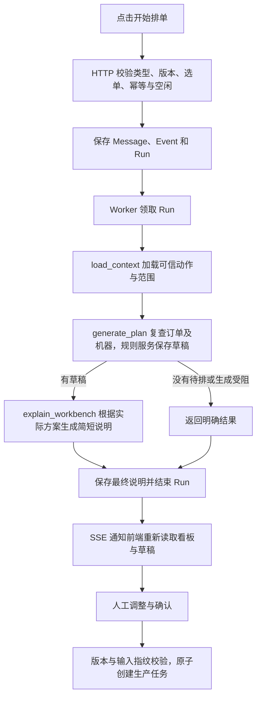

# 智能排单看板

状态：已实现，待用户本地验收 · 2026-09-13

本设计替代排单助手的聊天区和独立草案表单。正式排单规则不变；与创建订单工作台一样，Session 用于后台执行关联。

## 页面与操作

入口为 AI 助手首页的“开始排单”和正式排单看板的“智能排单”，进入同一工作台，优先恢复本人已有待确认草稿。

- 顶部固定步骤说明、选中/已安排/未安排数量及主按钮。
- 左列显示真实待排订单。勾选后用浅橙色边框高亮，支持全选、清空。未选订单不参与本次计算。
- 每台机器一列，复用正式看板的机器、订单与任务卡片。已有任务只读，可查看订单详情。
- 生成后，仅在前端预览中将已安排订单移到推荐机器下；浅橙色卡片明确标记“本次草稿 · 确认后下发”。未安排的选中订单留在左列并显示原因。
- 可以拖动整个草稿任务换机器，或用下拉选择机器；上移/下移调整同机新增任务顺序。订单可单独移回未安排、移到新任务或合入另一草稿任务。
- 每次调整提交同一份后端草稿并进行能力、规格、配方和重复订单校验。服务端确认后更新位置；保存中禁止继续操作，失败保留已保存版本并显示错误。不产生正式生产写入。
- 顶部“排单说明”最多三句，任务卡片可展开具体安排依据。手工修改后展示已验证的调整说明，避免沿用旧 AI 解释。
- “确认排单”先弹出本次订单/任务/未安排数量，确认后原子下发。放弃、重新生成也使用统一确认弹窗。
- 手机固定顶部操作，机器列横向滑动；每列独立纵向滚动，不撑宽页面。

## 请求与运行

`POST /agent/v2/scheduling/workspace` 复用本人 ACTIVE SCHEDULING Session（有草稿优先）；无可用会话时创建。与录单入口共用用户行锁，避免连续点击产生多份工作区。

`POST /agent/v2/sessions/{id}/schedule`：

```json
{"expected_state_revision": 1, "order_ids": ["order-id"]}
```

必须带 `Idempotency-Key`。订单 ID 数组非空、不重复、最多 1000 项；全部必须仍为 PENDING 且未关联生产任务。不满足时整次拒绝，不静默缩小范围。会话必须属于本人且类型为 SCHEDULING、可写、无开放 Run、无当前草稿。

HTTP 在一个事务中保存结构化动作对应的 user Message、事件和 MESSAGE Run。选单范围加入幂等摘要，存入 `Run.config_snapshot.selected_order_ids`；`scheduling_workbench=true` 是后端设置的可信标记。`Session.state.scheduling_order_ids` 用于刷新恢复选择；确认后只保留未安排订单。



该按钮路径无需模型做意图识别，也不执行通用规划工具循环。排产分配使用现有确定性规则服务，LLM 只解释真实方案；说明请求失败使用实际任务数量生成短提示，不撤销已保存的草稿。已有文本 API 路径继续保留范围判断，但页面不提供聊天输入。

## 草稿与一致性

不新增数据库表或枚举。沿用 SchedulePlan 的 `input_order_ids`、JSON `input_fingerprint`、tasks、unassigned、revision。

- 新草稿指纹增加 `__selection_scope__: true`。订单内容及待排集合指纹只覆盖本次选中的订单；其他未选订单新增或修改不使本草稿过期。
- 机器集合、能力与实际任务队列继续进入指纹。选中订单被修改/占用，或机器实际排产变化时，草稿过期，必须重新生成。
- 旧无范围标记的草稿保留原全体待排集合校验，避免改变历史草稿含义。
- 修改不得增加 `input_order_ids` 之外的订单，所有已安排订单必须唯一。移回未安排后仍属于本次范围。
- 重新生成保留原选单范围，成功后替代原草稿；失败保留原草稿。Retry 同样携带原可信配置与范围。
- 下发必须检查最新 revision、实时输入指纹与所有机器批次约束，任务创建和订单状态变更全部原子完成，幂等重试不得重复下发。
- 看板和草稿通过 SSE 与每 15 秒读取恢复；读取失败保留已知数据、阻止确认，刷新成功后恢复。

## 代码与验收

前端：`SchedulingWorkbench` 负责操作与说明，`useSchedulingWorkbench` 负责读取/互斥/保存，`SchedulingDraftBoard` 负责预览和调整；复用 `MachineColumn`、`TaskCard`、`OrderCard`，正式看板默认行为保持不变。旧聊天展示和独立草案编辑组件移除。

后端：`agent_session_service` 接收结构化动作，`scheduling_graph` 编排，`agent_schedule_service` 管理草稿生命周期，`schedule_service` 校验和执行排产。

自动验证覆盖选单范围、幂等重试、范围外订单拒绝、未选订单变化、已选订单过期、替换范围保持、模型说明失败、未确认不下发、换机保存、拆单、弹窗取消/失败、刷新恢复与手机布局。全栈测试使用隔离数据库与固定模型验证业务链路；真实模型解释质量仍需用户本地试用评价。


## 米数排产（2026-09-15）

米数订单保留原数量和 m 单位，允许生成草稿任务、合并米数订单、换机、调整顺序、退回、人工确认及正式看板操作。规格、设备启用、品类、花纹、宽幅等硬限制继续执行；不把缺少重量换算作为不能排单的原因。

米数订单之间允许按相同生产签名及合计幅宽合并，不要求米数相等，每笔保留原数量与单位。单笔不足机器最小幅宽时可尝试与其他米数订单合并。m 与 kg/g/t 不混合；前端提供同类单位的合单入口，后端在生成、修改、确认和手动任务创建/移单时统一校验。移除“按米数 · 独立生产”标签，重量订单的既有合单逻辑保持不变。

选中的订单或任一启用机器的未完成队列包含米数时，全体候选机器统一以未完成任务数作同等条件下的粗略负载参考，包含本轮已生成的草稿任务；不比较 m 与 kg，不声称估算生产时长。全部为重量时仍使用公斤负载。已完成米数任务不影响指标选择。

Plan 返回 load_basis=TASK_COUNT/WEIGHT_KG，供看板和简短模型说明使用。米数任务 total_quantity_kg=null（未知，不是0），total_quantity_m 为原米数；订单 quantity/unit 完全不变。手工修改草稿重新校验、计算任务汇总。

输入指纹增加 __scheduling_rules__=2 和 __load_basis__，不新增表或修改数据库结构。旧规则草稿需显式重新生成，不能直接修改或确认下发；旧草稿及正式生产任务保留。录单不再产生 WEIGHT_CONVERSION_UNAVAILABLE 提示，已有草稿查询时过滤该已废止提示，历史内容不改写。
